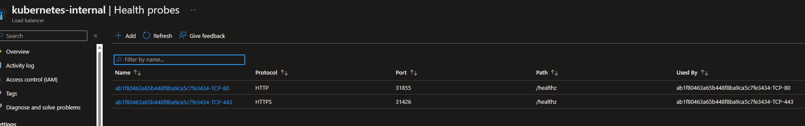
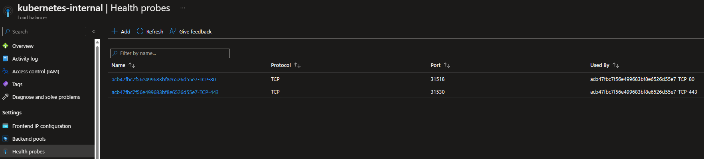

# aks-healthprobes
Sample code how to statically configure TCP health probes in a ingress-internal LB. Requires k8s >1.24

First, we are deploying nginx-ingress:
```
helm repo add ingress-nginx https://kubernetes.github.io/ingress-nginx
helm install ingress-nginx ingress-nginx/ingress-nginx \
    --version 4.1.3 \
    --namespace ingress-basic \
    --create-namespace \
    --set controller.replicaCount=2 \
    --set controller.nodeSelector."kubernetes\.io/os"=linux \
    --set controller.image.digest="" \
    --set controller.admissionWebhooks.patch.nodeSelector."kubernetes\.io/os"=linux \
    --set controller.service.annotations."service\.beta\.kubernetes\.io/azure-load-balancer-health-probe-request-path"=/healthz \
    --set defaultBackend.nodeSelector."kubernetes\.io/os"=linux \
    --set defaultBackend.image.digest="" \
    -f internal-ingress.yaml
```

next, deploy the sample app:
kubectl apply -f https://raw.githubusercontent.com/Azure/application-gateway-kubernetes-ingress/master/docs/examples/aspnetapp.yaml

Your Health Probes will look like this:


If we want to use TCP for our health probes, add service.beta.kubernetes.io/port_<portname>_health-probe_protocol: "tcp":
```
helm install ingress-nginx ingress-nginx/ingress-nginx \
    --version 4.1.3 \
    --namespace ingress-basic \
    --create-namespace \
    --set controller.replicaCount=2 \
    --set controller.nodeSelector."kubernetes\.io/os"=linux \
    --set controller.image.digest="" \
    --set controller.admissionWebhooks.patch.nodeSelector."kubernetes\.io/os"=linux \
    --set controller.service.annotations."service\.beta\.kubernetes\.io/azure-load-balancer-health-probe-request-path"=/healthz \
    --set defaultBackend.nodeSelector."kubernetes\.io/os"=linux \
    --set defaultBackend.image.digest="" \
    --set controller.service.annotations."service\.beta\.kubernetes\.io/port_80_health-probe_protocol"=tcp \
    --set controller.service.annotations."service\.beta\.kubernetes\.io/port_443_health-probe_protocol"=tcp \
    -f internal-ingress-tcp.yaml
```

Now, your health probes will be (permantently) switched to TCP:

